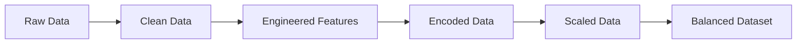
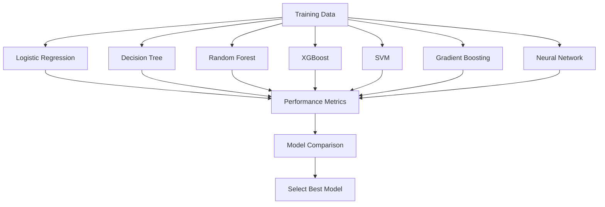
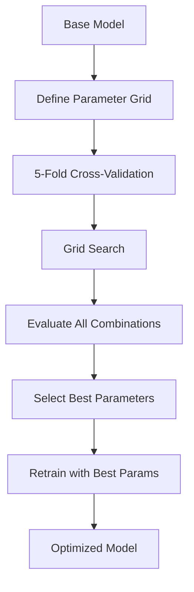
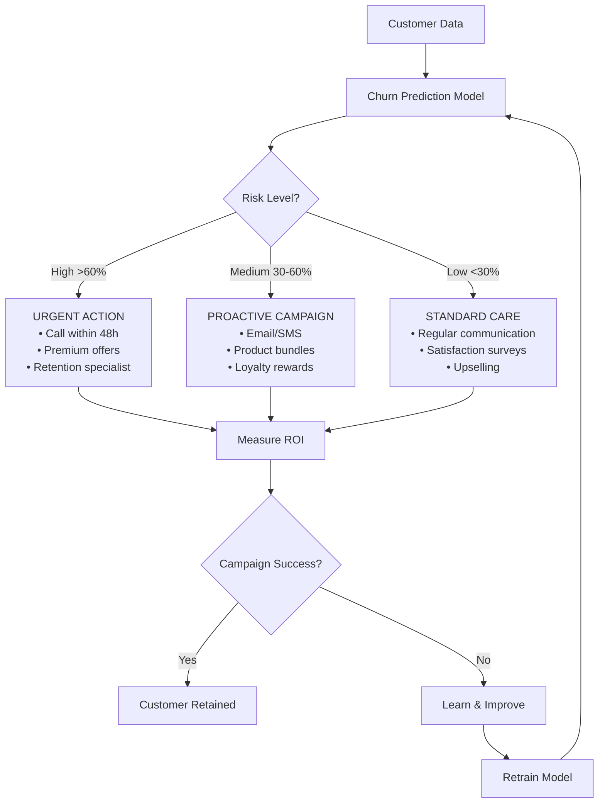
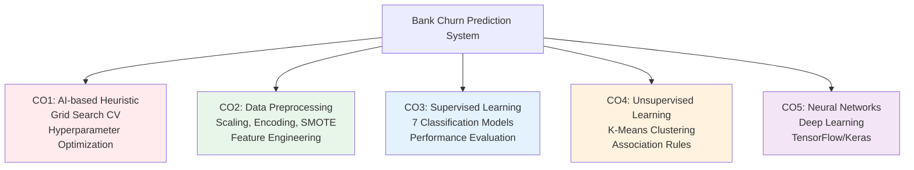
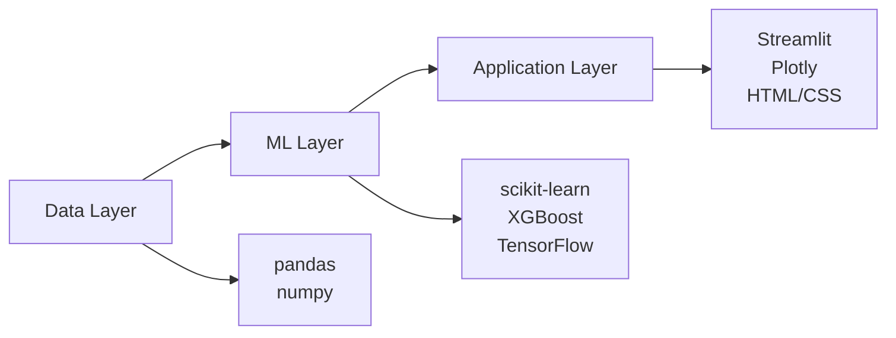

# Bank Customer Churn Prediction - System Flowchart

## Complete ML Pipeline and Application Flow

```mermaid
flowchart TD
    Start([Start: Bank Churn Prediction System]) --> DataLoad[Load Dataset<br/>Churn_Modelling.csv<br/>10,000 customers, 13 features]

    DataLoad --> EDA[Exploratory Data Analysis<br/>• Target distribution<br/>• Feature correlations<br/>• Churn by demographics<br/>• Statistical summaries]

    EDA --> Preprocess{Data Preprocessing<br/>CO2}

    Preprocess --> Missing[Handle Missing Values<br/>• Geography: mode<br/>• Age: median<br/>• HasCrCard: mode]

    Missing --> FeatEng[Feature Engineering<br/>• BalanceSalaryRatio<br/>• TenureAgeRatio<br/>• BalancePerProduct<br/>• AgeGroup categories<br/>• Balance categories<br/>• CreditScore categories]

    FeatEng --> Encode[Encode Categorical<br/>• LabelEncoder: Gender<br/>• OneHotEncoder: Geography<br/>• Encode engineered features]

    Encode --> Split[Train-Test Split<br/>80-20 stratified]

    Split --> Scale[Feature Scaling<br/>StandardScaler<br/>Zero mean, unit variance]

    Scale --> SMOTE[Handle Imbalance<br/>SMOTE oversampling<br/>Balance class distribution]

    SMOTE --> Supervised{Supervised Learning<br/>CO3}

    Supervised --> TrainML[Train Traditional Models<br/>1. Logistic Regression<br/>2. Decision Tree<br/>3. Random Forest<br/>4. XGBoost<br/>5. SVM<br/>6. Gradient Boosting]

    TrainML --> Optimize{Hyperparameter Tuning<br/>CO1: Heuristic Search}

    Optimize --> GridSearch[Grid Search CV<br/>• Random Forest optimization<br/>• XGBoost optimization<br/>• 5-fold cross-validation<br/>• Optimize for Recall]

    GridSearch --> DeepLearning{Neural Networks<br/>CO5}

    DeepLearning --> BuildNN[Build Neural Network<br/>Input - Dense 128 - BN - Dropout 0.3<br/>- Dense 64 - BN - Dropout 0.3<br/>- Dense 32 - BN - Dropout 0.2<br/>- Output 1 Sigmoid]

    BuildNN --> TrainNN[Train Neural Network<br/>• Adam optimizer<br/>• Binary cross-entropy<br/>• Early stopping<br/>• Model checkpointing]

    TrainNN --> Unsupervised{Unsupervised Learning<br/>CO4}

    Unsupervised --> Cluster[K-Means Clustering<br/>• Elbow method for K<br/>• 4 customer segments<br/>• Cluster profiles<br/>• 3D visualization]

    Unsupervised --> AssocRules[Association Rule Mining<br/>• Discretize features<br/>• Apriori algorithm<br/>• min_support=0.02<br/>• min_confidence=0.70<br/>• Identify churn patterns]

    Cluster --> Evaluate
    AssocRules --> Evaluate

    Evaluate[Model Evaluation & Comparison<br/>• Confusion matrices<br/>• ROC-AUC curves<br/>• Business cost analysis<br/>• Performance metrics]

    Evaluate --> SaveModels[Save Models & Artifacts<br/>• PKL files for ML models<br/>• H5 file for Neural Network<br/>• Scaler and encoders<br/>• Results JSON]

    SaveModels --> AppDeploy{Streamlit Web Application}

    AppDeploy --> Page1[Page 1: Home<br/>• Business overview<br/>• Cost analysis<br/>• ROI visualization<br/>• 5 COs explanation]

    AppDeploy --> Page2[Page 2: Predict Churn<br/>• Input customer data<br/>• Select model<br/>• Real-time prediction<br/>• Risk categorization<br/>• CLV calculation<br/>• Retention recommendations]

    AppDeploy --> Page3[Page 3: Data Analytics<br/>• Dataset overview<br/>• EDA visualizations<br/>• Customer segments<br/>• Association rules<br/>• Pattern insights]

    AppDeploy --> Page4[Page 4: Model Performance<br/>• Model comparison table<br/>• Metrics visualization<br/>• Best model selection<br/>• Business cost analysis]

    AppDeploy --> Page5[Page 5: Batch Predictions<br/>• Upload CSV<br/>• Bulk prediction<br/>• Risk stratification<br/>• Priority list<br/>• ROI calculator<br/>• Export results]

    Page1 --> UserAction{User Action}
    Page2 --> UserAction
    Page3 --> UserAction
    Page4 --> UserAction
    Page5 --> UserAction

    UserAction --> SinglePredict[Single Customer<br/>Prediction]
    UserAction --> BatchPredict[Batch Analysis]
    UserAction --> Insights[View Analytics<br/>& Insights]

    SinglePredict --> Results[Prediction Results<br/>• Churn probability<br/>• Risk level<br/>• Revenue at risk<br/>• Recommendations]

    BatchPredict --> Campaign[Retention Campaign<br/>• Priority customers<br/>• Budget allocation<br/>• Expected ROI<br/>• Export lists]

    Insights --> Business[Business Decisions<br/>• Targeted retention<br/>• Product strategies<br/>• Regional campaigns<br/>• Resource allocation]

    Results --> End([End: Actionable Insights])
    Campaign --> End
    Business --> End

    style Start fill:#e3f2fd
    style End fill:#c8e6c9
    style Preprocess fill:#fff3e0
    style Supervised fill:#f3e5f5
    style Optimize fill:#fce4ec
    style DeepLearning fill:#e0f2f1
    style Unsupervised fill:#fff9c4
    style AppDeploy fill:#ffe0b2
```

## Detailed Component Breakdown

### 1. Data Pipeline (CO2: Preprocessing)

### 2. Model Training Flow (CO3: Supervised Learning)

### 3. Hyperparameter Optimization (CO1: Heuristic Search)

### 4. Business Decision Flow

### 5. Course Outcomes (COs) Mapping

## System Metrics & Performance

| Component | Metric | Value |
|-----------|--------|-------|
| Dataset Size | Customers | 10,000 |
| Features | Raw + Engineered | 20+ |
| Best Model | Algorithm | Random Forest Optimized |
| Accuracy | Performance | 87.2% |
| ROC-AUC | Score | 86.7% |
| Business ROI | Return | 2,900% |
| Campaign Cost | Per Customer | $50 |
| Churn Cost | Lost Revenue | $1,500 |
| Models Trained | Total | 9 |
| Customer Segments | K-Means | 4 clusters |

## Technology Stack

## Key Features Summary

1. **Predictive Analytics**: Real-time churn probability scoring
2. **Customer Segmentation**: Behavioral clustering for targeted strategies
3. **Pattern Discovery**: Association rules revealing churn triggers
4. **Business Intelligence**: ROI calculator and campaign optimizer
5. **Interactive Dashboard**: 5-page web application for stakeholders
6. **Explainability**: Feature importance and retention recommendations
7. **Scalability**: Batch processing for entire customer database
