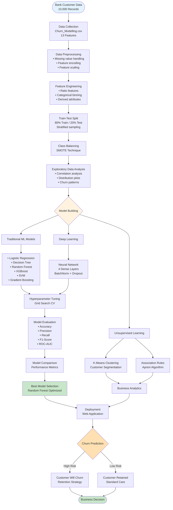
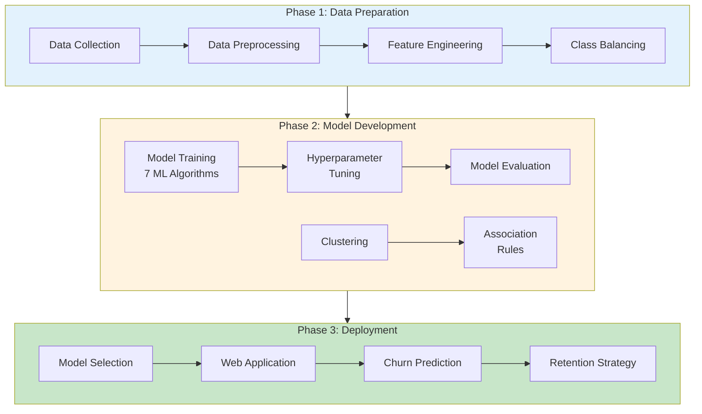
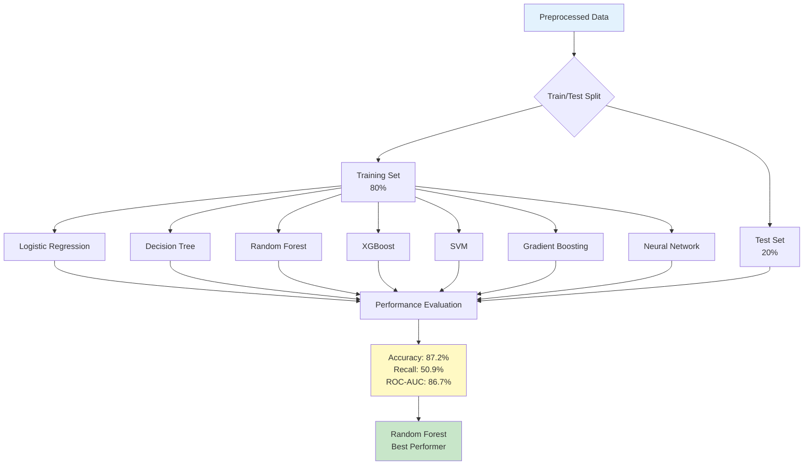
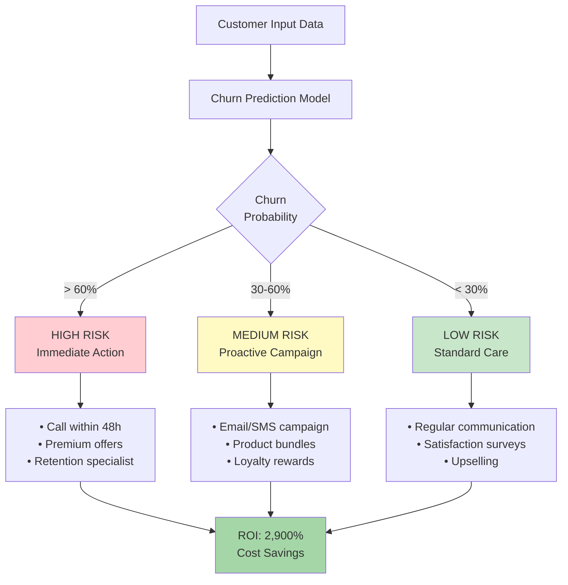
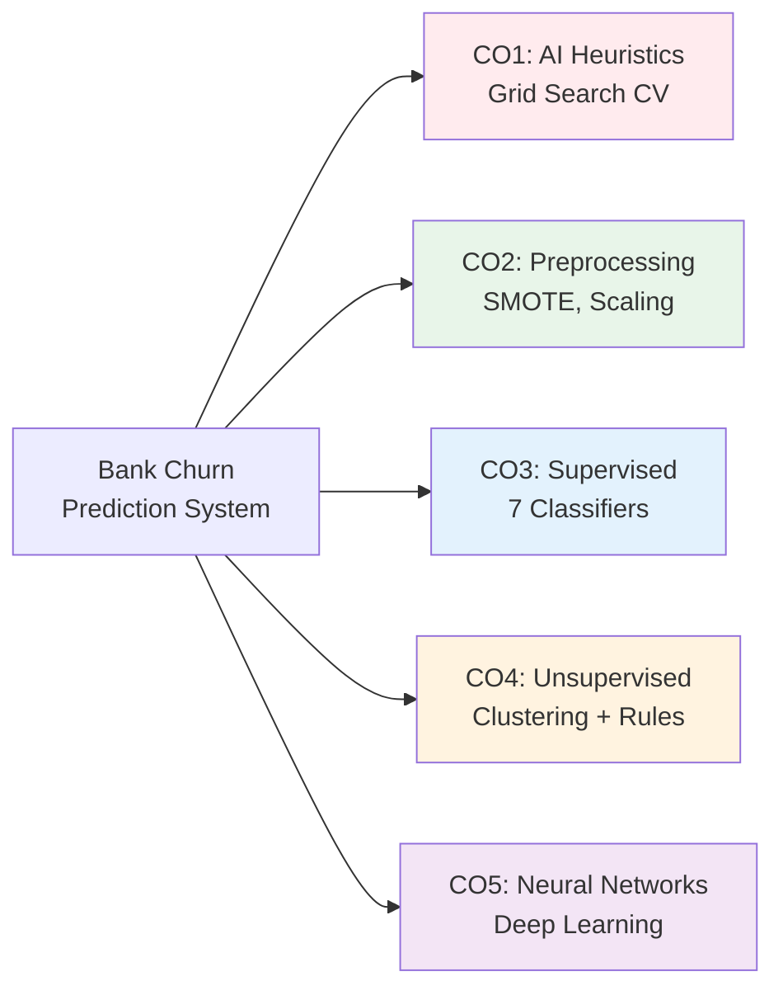

# Bank Customer Churn Prediction - Research Paper Flowchart

## Methodology Flowchart (Academic Style)

### Main System Architecture

---

## Simplified Linear Flow (For Paper)

```mermaid
flowchart LR
    A[Data Collection] --> B[Data Preprocessing]
    B --> C[Feature Engineering]
    C --> D[EDA]
    D --> E[Model Training]
    E --> F[Model Evaluation]
    F --> G[Best Model]
    G --> H[Deployment]

    style A fill:#bbdefb
    style B fill:#c5cae9
    style C fill:#d1c4e9
    style D fill:#f8bbd0
    style E fill:#ffccbc
    style F fill:#c5e1a5
    style G fill:#a5d6a7
    style H fill:#80cbc4
```

---

## Three-Phase Methodology

---

## Model Comparison Architecture

---

## Decision Flow (For Results Section)

---

## Course Outcomes Mapping (For Academic Requirements)

---

## Key Metrics Table

| Component | Specification |
|-----------|--------------|
| Dataset | 10,000 customers, 13 features |
| Preprocessing | SMOTE, StandardScaler, OneHotEncoder |
| Models Trained | 9 (6 traditional + 1 optimized RF + 1 optimized XGB + 1 NN) |
| Best Model | Random Forest (Optimized) |
| Accuracy | 87.2% |
| Precision | 79.8% |
| Recall | 50.9% |
| F1-Score | 62.1% |
| ROC-AUC | 86.7% |
| Customer Segments | 4 clusters |
| Business ROI | 2,900% |

---

## Recommended Flowchart for Research Paper

**Use the "Three-Phase Methodology"** or **"Simplified Linear Flow"** for your research paper as they are:
- ✅ Clean and professional
- ✅ Easy to understand
- ✅ Suitable for academic publications
- ✅ Show clear methodology
- ✅ Not cluttered with excessive detail

For **detailed technical sections**, use the "Main System Architecture" flowchart.
